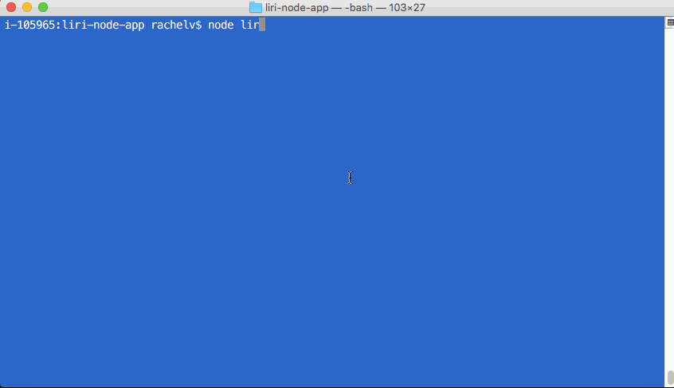
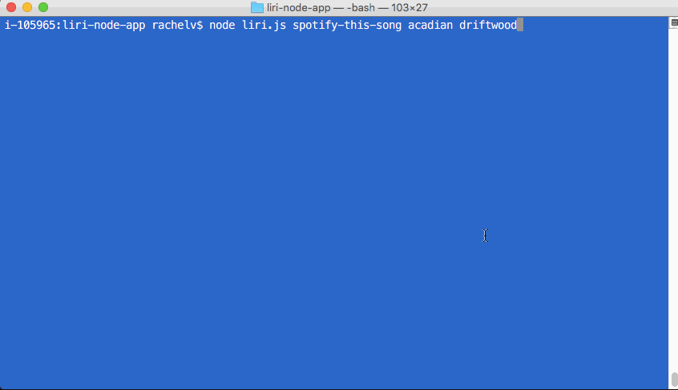
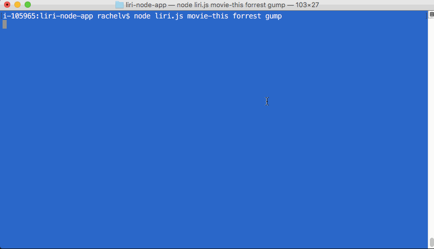

# liri-node-app

A Node app connecting to various APIs to retrieve tweets, song info, and movie info.

APIs used: 

* Twitter
* Spotify
* OMDB

1. From the terminal, input the command "my-tweets" to get user Twitter timeline statuses:

1. Input the command "spotify-this-song" followed by the song title for that song's artist, name, Spotify preview link, and album. If no song is input, the default information returned is for Queen's Bohemian Rhapsody. This portion of the app had the most trouble. Frequently, the info returned is not for the correct song.

1. Input the command "movie-this" and a movie title to get info on that movie. Inputting no title retrieves info on Mr. Nobody.

1. The command "do-what-it-says" will read the .txt file and run the command inside that file. Currently, the file is set to run the Spotify command.

